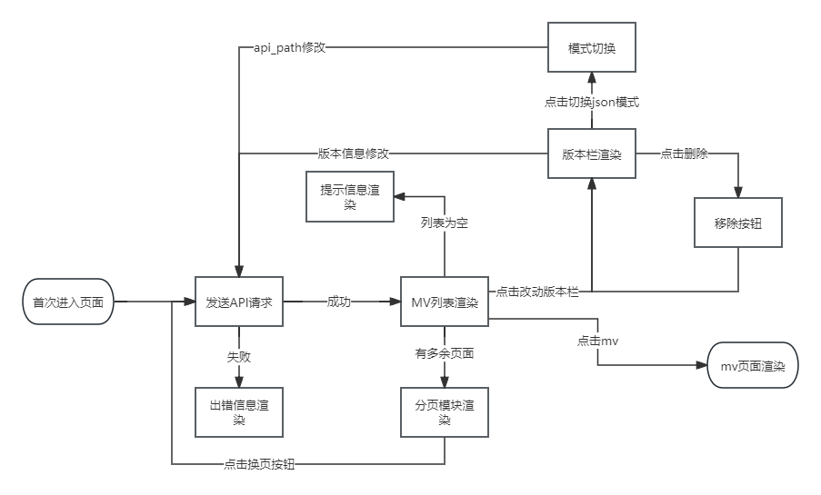

# Homework 3 总结

## 流程图

## 概述

1. 本项目采用简单分层模型，index.html 文件定义页面基本骨架，style.css 渲染页面样式，script.js 和其他辅助 js 文件定义了项目逻辑；
2. 大量使用了**事件代理**配合 **closest** 方法，减少了事件处理函数数量，降低了性能开销；
3. 封装了 **AJAX** 函数，使用 _async await_ 方法配合 _fetch_(_url_)获取 json 数据；
4. 实现了界面的**响应性**，用户点击后，tag 列表、mv 列表和分页模块等会实时渲染；
5. 完整构建了 QQ 音乐 mv 界面，完整复现了原界面所有样式，完成了要求的全部功能，并添加了一些特色功能；
6. 尝试使用了全新的 **CSS 嵌套方法**，使样式代码更简洁，继承关系更清晰，易于维护；
7. 大量使用了 flex 布局（选项列表等）和 grid 布局（mv 列表），使页面布局更灵活，更易维护；
8. 添加**媒体查询**，实现了页面的响应性，页面缩放或宽度缩短时，保证界面布局不会崩坏，也能做出正确的样式改变；
9. 大量使用了**三元式**判断方法(即"?:"方法)，使代码更简洁清晰；
10. 定义了 areas 和 versions 两个 **Map 对象**，用于存储区域和版本的信息。这使得代码更加清晰和易于管理；
11. 构建了完整的**出错处理**和**信息提示**系统，异步函数中严格编写 _try-catch_ block, 异步函数嵌套时，通过 _throw error_ 确保错误被正确处理。当 mv 列表为空（比如“最新-内地-儿歌”）或者 json 请求超时时，页面上会**渲染相应提示信息或错误信息**；
12. 通过 _import_ 语句导入了$函数和 AJAX 函数，以及配置项 ITEMS*PER_PAGE* 和 \_TIMEOUT_SEC。使得代码更加**模块化**和易于维护；
13. 使用了较多的**箭头函数**，拥抱 ES6 新语法。

## 特色功能

1. 完成了 mv 列表的**分页**功能，通过对 json 返回数据切分，实现分页功能，同时使用了 ScrollIntoView 方法，保证每次换页后视图都**自动切换到 mv 列表处**，既符合用户直觉，又方便了用户继续换页。不过首次加载时，**ScrollIntoView** 方法不会触发，页面标题会正常显示，这是通过添加一个 callTime 判断来实现的；
2. 实现了一定程度的**媒体查询和响应式处理**，宽度减小时，搜索框逐渐变窄（最终仅剩搜索框），mv 图片宽度逐渐减小（直到触发最小值），导航栏逐渐缩短（直到触发最小宽度）；
3. 添加了“开通 VIP”和“充值”按钮中的**箭头图标**，当鼠标移上时，通过添加"transform: rotate(180deg)"实现*箭头旋转动画*;
4. 给 MV 图片添加了一层**遮罩**，通过一个空 div+绝对定位+background-color+opacity 实现，当鼠标移上时，通过添加"opacity: 0.8"实现**遮罩层动画**，使图片动画更有质感；
5. 通过::**-webkit-scrollbar**及其衍生属性，简单修改了浏览器右侧和下方的**滚动条样式**，使其更加美观。

## 遇到的问题以及解决方式

1. 给网页的 main 区域添加 background-color 时，发现**_缩小浏览器宽度时，隐藏区域仍是白色_**。研究后，发现是 header 和 main 区域的宽度不匹配所导致，于是给 header 添加了左右 padding，并给 main 添加"margin:0 auto", 并给 header/main 添加相同的**最小宽度**，成功解决了该问题；
2. 当切换“最新”“最热”模式时，发现该栏出现闪烁问题，闪烁时**宽度塌陷**，“最新”“最热”栏目移至左侧与“MV”选项栏挤在一起。研究后，我发现整个 detail 模块并未设置宽度，其宽度由 list 中的 mv-item 撑起，当无数据或者加载数据前，list 模块为空，导致宽度塌陷。于是想到给上方切换栏添加一个 min-width，但是闪烁问题依然存在，因为 min-width 并不和正常情况下的栏宽度相等。继续研究后，想到只要让 detail 模块始终占满 main 模块即可，于是给该栏添加了"_width: 100%_"属性，成功解决了该问题。
3. 在做分页功能时，当 mv 数量不足一页，分页按钮不会出现，因此对按钮添加的事件处理会报错。思考后，我先使用了 html 的**行内方法 onclick** 确保点击事件生效。但之后我想我想到了 closest 方法。通过对换页按钮的父元素添加监听事件，并配合 **closest** 方法选中换页按钮，成功重构了该功能。

## 项目完善

项目功能基本完成后，我重新审视了我的代码，并做了一些改动。

1. 根据上次课中老师所提到的，代码中出现大量 _querySelector_ 的问题，我对选择器功能做了**函数封装**，并命名为"$"，这样，在代码中，只需要使用"$"即可调用函数，选择器更加简洁；
2. 起初我认为这只是一个小的练习项目，对语义化要求不必太高，因此在 area 和 version 的选择中，我使用了 0 开头的数字来对子类进行编码和区分，但我认为还是要严格要求自己的代码，因此，我重新用**语义化的类名**区分了这些子元素；
3. 在本项目中，我添加了一个特色功能，即**分页功能**，我在做这个功能的时候发现一个问题。分页的模块不一定存在，只有当 mv 数量较多时才会分页，因此，直接选中换页按钮并添加 addEventListener 很可能导致报错。思考后，我自认为用了一个很好的方法，即 html 的行内方法 onclick, 这样就能确保点击事件能生效。但是，我想到，这样的写法并不标准，也不利于后期维护，我们应尽可能使 html 代码简洁专注。因此，我重新思考后，想到了 _closest_ 方法。通过对换页按钮的父元素添加监听事件，并配合 closest 方法选中换页按钮，如果按钮不存在则直接返回，最终成功重构了该功能。这也是事件代理中常用的一个方法；
4. 重新回头看代码时，发现部分方法**代码过多**，**逻辑复杂**，不利于修改维护。由于缺乏严格的方法规划，部分方法一直在加入新逻辑，比如 renderDetails 模块，内部包含了模版 html 构建、页数判断、AJAX 数据请求、页数判断渲染和出错渲染等逻辑，导致代码臃肿。因此，我重新规划了 renderDetails 方法，将其**拆分**为 renderDetail、controlPagination、renderTagsMarkup 和 renderError 等方法，分别负责不同的功能。这样，代码逻辑更加清晰，也方便后期维护。

## 反思

1. 此次作业中，我多次遇到宽度显示异常的问题。我认为，元素宽度应尽量不设置或者少设置，因为如果过多设置 width 属性，会导致元素间宽度关系混乱，不利于维护，实际中只需要让子元素撑开父元素即可。但我发现，有些时候仍需要合理设置元素宽度，比如设为“100%”或者“auto”等，以实现占据父元素宽度或**自适应宽度**等目的，这样才能更好地实现页面的布局；
2. 除此之外，我发现**元素定位**实在是一门大学问。此前，我发现 flex 布局和 grid 布局十分灵活好用，用于实现列表、居中等布局非常容易。但我也发现 flex 布局仍不能完成所有布局任务。比如“开通 VIP”模块中，我本来想用 flex 布局实现，在原 block 下方加一个 div，并控制该 div 的显隐，但实际操作中发现，这样会撑开 header 的高度。因此，研究后我采用了绝对定位，给下方的 div 设置一个固定的 top 和 left 值，最终实现了预期布局。虽然这样仍有些愚笨，也不利于后期的更改与维护，但不可否认，相对定位、绝对定位、float 布局和 table 等布局方式仍有自己的用武之地。flex 布局虽好用，但只有牢固掌握各种布局方式，才能成为真正的前端大佬！
3. 代码写到中途的时候，我想到这个界面如果用 **MVC 模型**来做会更合适。将**_model、controller 和 View 层_**分开，能让代码更清晰、简介，项目间的文件关系更清楚，同时有利于长期开发和维护。以 View 视图层为例，可以添加多个 view 文件，比如 tagView(mv 列表上的标签视图)、detailView(mv 列表视图)、itemView(mv 列表中的单个 mv 视图)和 paginationView(分页视图)等，写一个 View.js 文件，定义一些公共数据和方法，比如定义父元素、成功信息和失败信息等，定义渲染、清除和事件处理等方法。然后在每个 view 文件中继承 View.js 文件，实现自己的方法，比如 itemView 文件中，可以定义一个 item 方法，用于渲染单个 mv 列表项。这样，在 controller 文件中，只需要调用 view 文件中的方法，即可实现渲染；
4. 由于项目基本成型，我没有再对项目进行重构，但我想，如果下次再遇到类似项目，我会尝试用 MVC 模型来写，以实现代码的**模块化**和可维护性。但是，我也回头简单修改一下项目结构，引入了 helpers.js 和 config.js 文件，分别存放公共方法和公共数据。在 helpers.js 中，我手动编写了 **AJAX**函数，用于发送 ajax 请求，并配合一个 timeout 计时器函数，用于超时处理时返回一个 **reject Promise**。在 config.js 中，我存放了一些公共数据，比如请求的 url、每页的 mv 数目和超时规定时间等，并在 script.js 中引入。这样，代码结构更加清晰，也方便后期维护。以后还可以在页面中添加一个每页 mv 数量的功能，根据用户选择的数量，修改 config.js 中的数据，即可实现每页 mv 数量的修改；
5. 由于项目代码量稍大，我没有对代码做太多的优化。但是，我也学到了一个宝贵的经验。**良好的项目规划十分重要**，只有在一开始就画好设计图，打好框架，才能写出良好的项目代码，同时也能更加容易维护。今后我一定汲取此教训，更加重视项目规划；
6. 在项目代码编写中，**JSDoc**可以起到很大的作用。如果能在每个函数前添加**注释**，说明该函数的功能和参数，并在函数内部添加**注释**，说明该函数的实现思路和关键代码，这样也能让代码更加易读，方便后期维护。但由于我没有把这条规则牢记于心，所以我只是在每个函数方法前添加了简单的功能描述，今后我会更加注意这一点，努力为每个方法添加完整、规范的注释。
